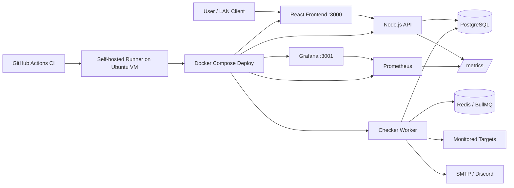

# Pulse Check

Pulse Check is a DevOps-focused uptime monitoring platform that checks websites and APIs on a schedule, records availability and response-time history, opens incidents when targets go down, and provides both an authenticated dashboard and public status pages.

## Architecture



## What This Project Demonstrates

- Full-stack application development with React and Node.js/TypeScript
- Background job processing with Redis and BullMQ
- PostgreSQL persistence and incident history
- Docker multi-stage builds and Docker Compose
- CI with GitHub Actions
- CD to an Ubuntu VM using a self-hosted GitHub Actions runner
- production secrets kept outside Git
- health/readiness checks and simple rollback
- Prometheus metrics and Grafana dashboards

## Tech Stack

| Area | Technology |
| --- | --- |
| Frontend | React, TypeScript, Vite, Nginx |
| Backend | Node.js, TypeScript, Express |
| Database | PostgreSQL |
| Queue | Redis, BullMQ |
| Auth | JWT, bcrypt |
| Notifications | SMTP, Discord Webhook |
| Testing | Vitest, Supertest |
| Containers | Docker, Docker Compose |
| CI/CD | GitHub Actions, Self-hosted Runner |
| Monitoring | Prometheus, Grafana |

## Main Features

- registration and login
- monitor CRUD
- scheduled HTTP/HTTPS uptime checks
- UP / DOWN / UNKNOWN state tracking
- response-time history
- incident creation and recovery handling
- public status pages
- SMTP and Discord notifications
- `/healthz`, `/readyz`, and `/metrics` endpoints
- Grafana dashboard for request rate, 5xx errors, p95 latency, and monitor status

## Project Structure

```text
pulse-check/
├─ frontend/                  React frontend
├─ backend/                   API, worker, tests
├─ monitoring/                Prometheus + Grafana
├─ deploy/                    VM deployment docs/script
├─ docs/
│  ├─ architecture.md
│  ├─ resume-summary.md
│  └─ demo-checklist.md
├─ .github/workflows/
│  ├─ ci.yml
│  └─ deploy.yml
├─ docker-compose.yml
├─ docker-compose.prod.yml
└─ ROADMAP.md
```

## Run Locally

From the repository root:

```bash
docker compose up -d --build
```

Open:

```text
Pulse Check: http://localhost:3000
Grafana:     http://localhost:3001
Backend:     http://localhost:8080
```

Check containers:

```bash
docker compose ps
```

Stop:

```bash
docker compose down
```

## CI

`.github/workflows/ci.yml` runs on pull requests and pushes to `main`.

Backend:

```text
npm ci → lint → format check → tests → build
```

Frontend:

```text
npm ci → lint → format check → build
```

## Deployment

The current deployment target is an Ubuntu Server VM on VMware with a private LAN IP.

```text
push main
   ↓
CI passes
   ↓
Deploy workflow
   ↓
Self-hosted GitHub Actions Runner
   ↓
Docker Compose on Ubuntu VM
```

LAN access:

```text
Pulse Check: http://VM_PRIVATE_IP:3000
Grafana:     http://VM_PRIVATE_IP:3001
```

Production secrets are stored on the VM at:

```text
/opt/pulse-check/.env.production
```

See [deploy/README.md](deploy/README.md) for the VM deployment setup.

## Monitoring

Prometheus scrapes the backend at `app:8080/metrics` inside the Docker network. Prometheus itself is not exposed to the LAN.

Grafana is provisioned automatically with the `Pulse Check Overview` dashboard.

Metrics include:

- HTTP request rate
- HTTP 5xx error rate
- request latency histogram / p95
- monitor counts by `UP`, `DOWN`, and `UNKNOWN`
- default Node.js/process metrics

See [monitoring/README.md](monitoring/README.md).

## Security / Reliability Notes

- backend and frontend containers run as non-root users
- monitor checks reject direct private/local targets to reduce SSRF risk
- HTTP checks have timeout and redirect limits
- PostgreSQL and Redis are not exposed in the VM LAN deployment
- production secrets are not committed to Git
- PR CI stays on GitHub-hosted runners; the self-hosted VM runner is used only for deployment

## Portfolio / Resume

A resume-ready summary and interview talking points are available in [docs/resume-summary.md](docs/resume-summary.md).

For a short portfolio recording, use [docs/demo-checklist.md](docs/demo-checklist.md).

## Current Scope

Phases 0-6 are implemented with Phase 7 intentionally skipped. Phase 8 focuses on documentation and portfolio preparation.

Performance numbers are intentionally not claimed yet. Values such as maximum monitor capacity and p95/p99 latency should only be added after a repeatable load test.

See [ROADMAP.md](ROADMAP.md) for the project roadmap and [docs/architecture.md](docs/architecture.md) for detailed system design.
