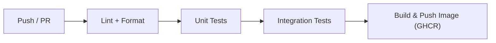
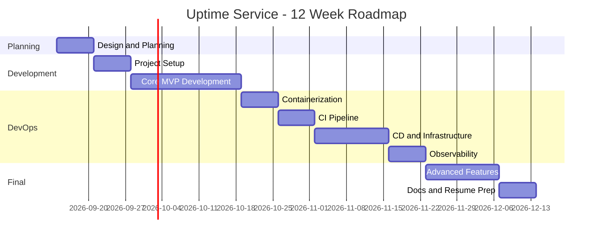

# 🚀 Roadmap: Uptime/Status Page Service (DevOps-Focused)

> เว็บที่คอย ping เว็บ/API เป็นระยะ แล้วแสดง Status Page พร้อม Alert ผ่าน Email/LINE
> เน้นกระบวนการพัฒนาด้วย DevOps Lifecycle และ Best Practices ตั้งแต่เริ่มต้นจนถึง Production

---

## 📋 Phase 0: Planning & Design (สัปดาห์ 1)

### สิ่งที่ต้องทำ

- [x] ออกแบบ **System Architecture Diagram**
- [x] สรุป Tech Stack ที่เลือกแบบย่อ

### Tech Stack แนะนำ

| ส่วน            | ตัวเลือก                                          |
| --------------- | ------------------------------------------------- |
| Backend         | Go / Node.js (NestJS) / Python (FastAPI)          |
| Frontend        | React / Next.js + TailwindCSS                     |
| Database        | PostgreSQL + TimescaleDB (เก็บ time-series ได้ดี) |
| Queue/Scheduler | Redis + BullMQ หรือ cron-based worker             |
| Notification    | Email (SMTP/Resend), LINE Messaging API*          |

---

## 🛠️ Phase 1: Project Setup & Foundation (สัปดาห์ 2)

### สิ่งที่ต้องทำ

- [x] ตั้งค่า **Git Workflow** — Branch strategy (GitHub Flow / Trunk-based)
- [x] ตั้งค่า Linter/Formatter สั้นๆ ในโปรเจค
- [x] ตั้งค่า `.env.example` และ config management
- [x] เขียน `README.md`

---

## 💻 Phase 2: Core Development — MVP (สัปดาห์ 3-5)

### Features (เรียงตามลำดับ)

1. **Auth** — สมัคร/ล็อกอิน (JWT หรือ session)
2. **Monitor CRUD** — เพิ่ม/ลบ/แก้ไข URL ที่ต้องการ monitor
   - HTTP/HTTPS check, interval (1/5/10 นาที), timeout, expected status code
3. **Checker Worker** — ตัว ping เว็บเป็นระยะ
   - แยกเป็น worker service ต่างหาก (สำคัญ! ได้โชว์ microservice)
   - เก็บผล: status, response time, timestamp
4. **Status Page** — หน้า public แสดง uptime %, response time graph, incident history
5. **Alerting** — แจ้งเตือนเมื่อ down/recover
   - Email + LINE Messaging API / Discord Webhook
   - Alert deduplication (ไม่สแปมซ้ำๆ)

### Testing (ทำไปพร้อมกัน!)

- [x] **Unit Tests**
- [ ] **Integration Tests** (ใช้ Testcontainers สำหรับ DB)
- [x] **API Tests** (Supertest)

### 🎯 DevOps Practice ที่ได้

- Test-Driven mindset
- Separation of concerns (API vs Worker)

---

## 🐳 Phase 3: Containerization (สัปดาห์ 6)

### สิ่งที่ต้องทำ

- [x] เขียน **Dockerfile** แบบ multi-stage build (image เล็ก, ปลอดภัย)
- [x] รันด้วย **non-root user**
- [x] **docker-compose.yml** สำหรับ local dev (app + worker + db + redis)
- [x] Health check endpoints (`/healthz`, `/readyz`)
- [x] **.dockerignore** ให้เรียบร้อย
- [x] Image scanning ด้วย **Trivy**

### 🎯 DevOps Practice ที่ได้

- Container best practices
- 12-Factor App principles

---

## ⚙️ Phase 4: CI Pipeline (สัปดาห์ 7)

### GitHub Actions Pipeline

### สิ่งที่ต้องทำ

- [x] CI รันทุก PR / push เข้า `main`
- [x] Backend: lint + format + test + build
- [x] Frontend: lint + format + build

### 🎯 DevOps Practice ที่ได้

- CI automation
- DevSecOps (shift-left security)

---

## 🚢 Phase 5: CD & Infrastructure — VM + Self-hosted Runner

### Deployment Path

- Ubuntu VM + Docker Compose
- GitHub Actions Self-hosted Runner บน VM สำหรับ deploy เท่านั้น
- CI ยังรันบน GitHub-hosted runner
- Frontend เปิดผ่าน private IP ของ VM ที่ port 3000
- Production secrets เก็บในไฟล์บน VM ไม่ commit เข้า Git

### สิ่งที่ต้องทำ

- [x] เพิ่ม production Docker Compose
- [x] เปิด frontend ผ่าน VM port 3000 สำหรับ LAN
- [x] เพิ่ม GitHub Actions deploy workflow สำหรับ self-hosted runner
- [x] แยก production secrets ออกจาก repository
- [x] ตรวจ health หลัง deploy ผ่าน `/readyz`
- [x] กำหนด rollback แบบ revert แล้ว redeploy commit ก่อนหน้า
- [x] ลงทะเบียน self-hosted runner บน VM จริง
- [x] ทดสอบการเข้าผ่าน private IP ภายใน LAN

### 🎯 DevOps Practice ที่ได้

- Continuous Deployment
- Self-hosted GitHub Actions Runner
- Docker Compose production deployment
- Basic secrets management

---

## 📊 Phase 6: Monitoring — Prometheus + Grafana

### สิ่งที่ต้องทำ

- [x] เพิ่ม backend `/metrics` endpoint
- [x] เก็บ HTTP request rate / error rate / latency metrics
- [x] เก็บจำนวน monitor แยกตาม `UP` / `DOWN` / `UNKNOWN`
- [x] เพิ่ม Prometheus service และ scrape backend
- [x] เพิ่ม Grafana service
- [x] Provision Prometheus datasource อัตโนมัติ
- [x] Provision Grafana dashboard พื้นฐาน
- [ ] ทดสอบ Grafana บน VM ผ่าน private IP port 3001

### 🎯 DevOps Practice ที่ได้

- Metrics-based monitoring
- Prometheus
- Grafana dashboards

---

## 🎨 Phase 7: Polish & Advanced Features — Skipped

### เลือกทำตามเวลา (แต่ละอันเพิ่มมูลค่า resume)

- [ ] **Multi-region checking** — worker หลาย location
- [ ] **SSL certificate expiry monitoring**
- [ ] **Custom domain** สำหรับ status page ของ user
- [ ] **Incident management** — สร้าง incident, post update
- [ ] **Public API** + API key + **rate limiting**
- [ ] **Load testing** ด้วย k6 + เขียนผลลัพธ์ลง docs
- [ ] Response time percentile graphs (p50/p95/p99)

---

## 📄 Phase 8: Documentation & Resume Prep

- [x] Architecture diagram ใน README
- [x] อัปเดต architecture document ให้ครอบคลุม CI/CD + monitoring
- [x] เพิ่ม resume / portfolio summary
- [x] เพิ่ม demo checklist สำหรับอัด video / GIF

---

## 🗓️ Timeline สรุป

