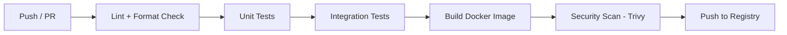
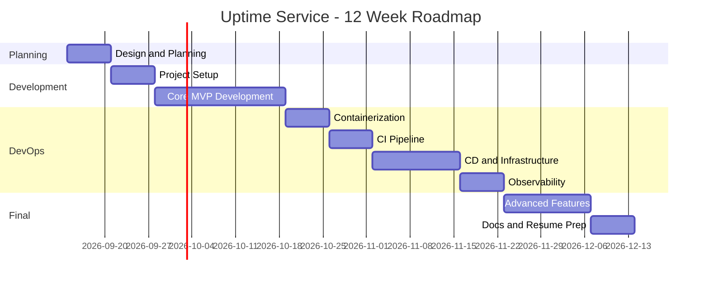

# 🚀 Roadmap: Uptime/Status Page Service (DevOps-Focused)

> เว็บที่คอย ping เว็บ/API เป็นระยะ แล้วแสดง Status Page พร้อม Alert ผ่าน Email/LINE
> เน้นกระบวนการพัฒนาด้วย DevOps Lifecycle และ Best Practices ตั้งแต่เริ่มต้นจนถึง Production

---

## 📋 Phase 0: Planning & Design (สัปดาห์ 1)

### สิ่งที่ต้องทำ
- [x] ออกแบบ **System Architecture Diagram**
- [x] สรุป Tech Stack ที่เลือกแบบย่อ

### Tech Stack แนะนำ

| ส่วน | ตัวเลือก |
|---|---|
| Backend | Go / Node.js (NestJS) / Python (FastAPI) |
| Frontend | React / Next.js + TailwindCSS |
| Database | PostgreSQL + TimescaleDB (เก็บ time-series ได้ดี) |
| Queue/Scheduler | Redis + BullMQ หรือ cron-based worker |
| Notification | Email (SMTP/Resend), LINE Messaging API* |

---

## 🛠️ Phase 1: Project Setup & Foundation (สัปดาห์ 2)

### สิ่งที่ต้องทำ
- [ ] ตั้งค่า **Monorepo** หรือแยก repo (frontend/backend)
- [ ] ตั้งค่า **Git Workflow** — Branch strategy (GitHub Flow / Trunk-based)
- [ ] ตั้ง **Branch Protection Rules** (require PR, review)
- [ ] Linter + Formatter (ESLint, Prettier / golangci-lint)
- [ ] **Pre-commit hooks** (Husky / lefthook)
- [ ] **Conventional Commits** + commitlint
- [ ] ตั้งค่า `.env.example` และ config management
- [ ] เขียน `README.md` + `CONTRIBUTING.md`

### 🎯 DevOps Practice ที่ได้
- Version Control Best Practices
- Code Quality Gates ตั้งแต่วันแรก

---

## 💻 Phase 2: Core Development — MVP (สัปดาห์ 3-5)

### Features (เรียงตามลำดับ)
1. **Auth** — สมัคร/ล็อกอิน (JWT หรือ session)
2. **Monitor CRUD** — เพิ่ม/ลบ/แก้ไข URL ที่ต้องการ monitor
   - HTTP/HTTPS check, interval (1/5/10 นาที), timeout, expected status code
3. **Checker Worker** — ตัว ping เว็บเป็นระยะ
   - แยกเป็น worker service ต่างหาก (สำคัญ! ได้โชว์ microservice)
   - เก็บผล: status, response time, timestamp
4. **Status Page** — หน้า public แสดง uptime %, response time graph, incident history
5. **Alerting** — แจ้งเตือนเมื่อ down/recover
   - Email + LINE Messaging API / Discord Webhook
   - Alert deduplication (ไม่สแปมซ้ำๆ)

### Testing (ทำไปพร้อมกัน!)
- [ ] **Unit Tests** (coverage ≥ 70%)
- [ ] **Integration Tests** (ใช้ Testcontainers สำหรับ DB)
- [ ] **API Tests** (Supertest / httptest)

### 🎯 DevOps Practice ที่ได้
- Test-Driven mindset
- Separation of concerns (API vs Worker)

---

## 🐳 Phase 3: Containerization (สัปดาห์ 6)

### สิ่งที่ต้องทำ
- [ ] เขียน **Dockerfile** แบบ multi-stage build (image เล็ก, ปลอดภัย)
- [ ] รันด้วย **non-root user**
- [ ] **docker-compose.yml** สำหรับ local dev (app + worker + db + redis)
- [ ] Health check endpoints (`/healthz`, `/readyz`)
- [ ] **.dockerignore** ให้เรียบร้อย
- [ ] Image scanning ด้วย **Trivy**

### 🎯 DevOps Practice ที่ได้
- Container best practices
- 12-Factor App principles

---

## ⚙️ Phase 4: CI Pipeline (สัปดาห์ 7)

### GitHub Actions Pipeline

### สิ่งที่ต้องทำ
- [ ] CI รันทุก PR: lint → test → build
- [ ] **Code coverage report** (Codecov)
- [ ] **SAST scanning** (CodeQL / Semgrep)
- [ ] **Dependency scanning** (Dependabot / Renovate)
- [ ] Push image ไป **GHCR** หรือ Docker Hub พร้อม tag ตาม semver + git SHA
- [ ] **Semantic Release** — auto versioning + changelog

### 🎯 DevOps Practice ที่ได้
- CI automation
- DevSecOps (shift-left security)

---

## 🚢 Phase 5: CD & Infrastructure (สัปดาห์ 8-9)

### เลือก Deployment Path (ตามงบ/เวลา)

**Path A: เรียบง่าย (แนะนำเริ่มก่อน)**
- VM Ubuntu Server + Docker Compose
- Deploy ผ่าน GitHub Actions (SSH deploy)
- Reverse proxy: **Caddy/Traefik** (auto HTTPS)

**Path B: ระดับ Production (โชว์สกิลเต็มที่)**
- **Kubernetes** (k3s บน VPS หรือ managed cluster)
- **Helm Chart** เขียนเอง
- **ArgoCD** — GitOps deployment
- **Terraform** — provision infrastructure

### สิ่งที่ต้องทำ (ทั้ง 2 path)
- [ ] **Infrastructure as Code** (Terraform / Ansible)
- [ ] แยก environment: `staging` และ `production`
- [ ] **Secrets management** (GitHub Secrets / SOPS / Vault)
- [ ] Database migration strategy (golang-migrate / Prisma migrate)
- [ ] **Zero-downtime deployment** (rolling update)
- [ ] Rollback strategy

### 🎯 DevOps Practice ที่ได้
- CD, GitOps, IaC
- Environment parity

---

## 📊 Phase 6: Observability (สัปดาห์ 10)

### สิ่งที่ต้องทำ
- [ ] **Structured Logging** (JSON logs) + centralize ด้วย Loki/Grafana
- [ ] **Metrics** — Prometheus + Grafana dashboard
  - Request rate, latency (p95/p99), error rate, worker queue depth
- [ ] **Tracing** (optional) — OpenTelemetry + Jaeger/Tempo
- [ ] **Alerting** — Alertmanager แจ้งเตือนเมื่อระบบตัวเองมีปัญหา
- [ ] Uptime ของตัวเองด้วย external checker (เช่น healthchecks.io)

### 🎯 DevOps Practice ที่ได้
- Three pillars of observability (Logs, Metrics, Traces)
- SLI/SLO thinking

---

## 🎨 Phase 7: Polish & Advanced Features (สัปดาห์ 11-12)

### เลือกทำตามเวลา (แต่ละอันเพิ่มมูลค่า resume)
- [ ] **Multi-region checking** — worker หลาย location
- [ ] **SSL certificate expiry monitoring**
- [ ] **Custom domain** สำหรับ status page ของ user
- [ ] **Incident management** — สร้าง incident, post update
- [ ] **Public API** + API key + **rate limiting**
- [ ] **Load testing** ด้วย k6 + เขียนผลลัพธ์ลง docs
- [ ] Response time percentile graphs (p50/p95/p99)

---

## 📄 Phase 8: Documentation & Resume Prep

- [ ] Architecture diagram สวยๆ ใน README
- [ ] Demo video / GIF
- [ ] Live demo URL
- [ ] เขียน blog post อธิบาย technical decisions (Medium/Dev.to)
- [ ] สรุป metrics: "รองรับ X monitors, check ทุก Y วินาที, p99 latency Z ms"

---

## 🗓️ Timeline สรุป

