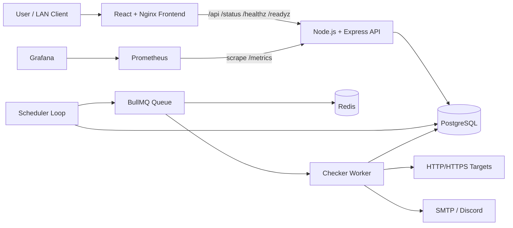
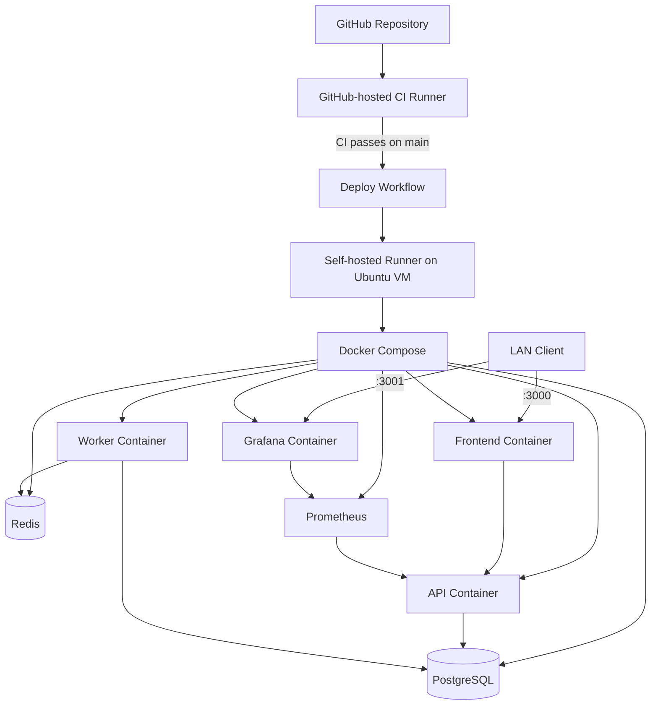

# System Architecture

## Overview

Pulse Check separates browser traffic, synchronous API work, asynchronous uptime checks, durable state, and monitoring infrastructure into independent services.

## Application Architecture

## Deployment Architecture

Only the frontend and Grafana ports are exposed in the current private-LAN VM deployment. PostgreSQL, Redis, Prometheus, and the backend API stay on the Docker network.

## Components

### Frontend

- React + TypeScript + Vite.
- Production assets are served by an unprivileged Nginx container.
- Nginx proxies API/status/health requests to the backend.

### API

- Node.js + TypeScript + Express.
- JWT authentication and monitor/status-page APIs.
- `/healthz` for liveness.
- `/readyz` for database readiness.
- `/metrics` for Prometheus.

### Worker and Queue

- Scheduler claims due monitors from PostgreSQL.
- BullMQ/Redis carries transient check jobs.
- Worker performs uptime checks and persists results.
- Incidents are opened on DOWN transitions and resolved on recovery.

### PostgreSQL

Durable source of truth for users, monitors, check results, incidents, status pages, and notification events.

### Prometheus

- Scrapes backend metrics every 15 seconds.
- Runs only inside the Docker network in the current deployment.

### Grafana

- Uses Prometheus as the provisioned datasource.
- Exposed on VM/LAN port 3001.
- Ships with the `Pulse Check Overview` dashboard.

## CI/CD Boundary

Pull-request and main-branch CI uses GitHub-hosted runners. The self-hosted Ubuntu runner is reserved for deployment after CI succeeds, reducing the risk of untrusted PR code running directly on the VM.

## Rollback

The project uses a simple Git-based rollback strategy: revert the problematic commit, let CI pass, and allow the deploy workflow to redeploy the known-good source.
