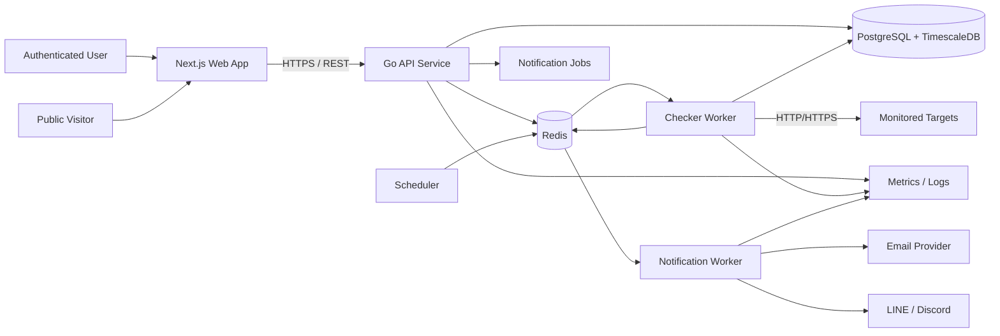
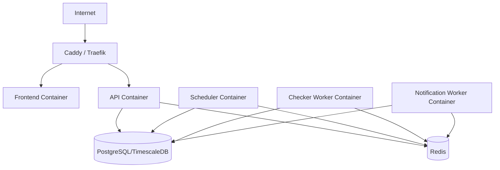

# System Architecture

## 1. Overview

Pulse Check uses a small service-oriented architecture. The synchronous HTTP API is separated from asynchronous endpoint checking so that user traffic and monitoring workloads can scale independently.

## 2. High-Level Architecture

## 3. Components

### Web App

- Next.js frontend.
- Provides authenticated dashboard and public status pages.
- Calls the API over HTTPS.
- Does not directly access the database.

### API Service

- Go HTTP service.
- Handles authentication, monitor CRUD, status-page configuration, and read APIs.
- Performs validation and authorization.
- Publishes asynchronous work where appropriate.

### Scheduler

- Identifies monitors whose next check is due.
- Enqueues check jobs in Redis.
- Must avoid issuing duplicate jobs for the same scheduled check.

### Checker Worker

- Consumes check jobs.
- Performs outbound HTTP/HTTPS checks.
- Records check results.
- Determines effective state transitions.
- Enqueues notifications when DOWN/RECOVERED transitions occur.

### Notification Worker

- Sends notification events through configured providers.
- Retries transient provider failures.
- Uses an event/idempotency key to avoid duplicate sends.

### PostgreSQL + TimescaleDB

- PostgreSQL is the source of truth for users, monitors, status pages, incidents, and notification configuration.
- TimescaleDB is used for time-series check results and efficient time-window aggregation.

### Redis

- Queue transport for checks and notifications.
- Supports distributed scheduling/locking and short-lived coordination.
- Is not the system of record.

## 4. Primary Data Flows

### Monitor creation

1. User submits a monitor through the web app.
2. API validates authentication, URL, interval, timeout, and expected status.
3. API stores the monitor in PostgreSQL.
4. Scheduler observes it as eligible for a future check.

### Health check

1. Scheduler identifies a due monitor.
2. Scheduler enqueues a check job.
3. Checker worker requests the target URL.
4. Worker records the result in the database.
5. Worker compares the result with the current monitor state.
6. If the state changes to DOWN or RECOVERED, an incident/state-transition record is persisted and a notification event is enqueued.

### Public status page

1. Public visitor requests a status-page slug.
2. Frontend calls the public API.
3. API reads public monitor metadata, current state, uptime aggregation, and incident history.
4. No authentication is required, but only explicitly published data is returned.

## 5. Reliability Boundaries

- Database is authoritative for durable state.
- Redis queue items may be retried and therefore consumers must be idempotent.
- Notification sending is separated from state persistence.
- A target endpoint failure must never crash the checker process.
- API and worker deployments are independently scalable.

## 6. Security Boundaries

- Only the API exposes the application data plane publicly.
- Database and Redis stay on private networks in production.
- Worker outbound requests require SSRF mitigation:
  - allow only HTTP/HTTPS
  - reject localhost/link-local/private network targets unless explicitly supported
  - resolve and validate DNS/IP safely
  - limit redirects and revalidate redirect destinations
- Secrets are injected through environment/secrets management.
- Public status responses must not include internal error traces, notification credentials, or private monitor metadata.

## 7. Deployment View

For the first production path:

All application services are designed to be containerized and later deployable either through Docker Compose on a VM or Kubernetes without changing application contracts.
