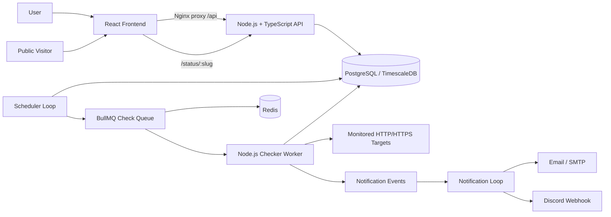
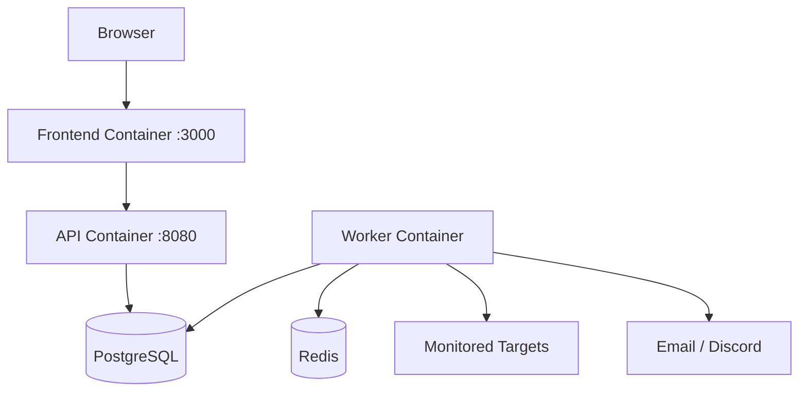

# System Architecture

## Overview

Pulse Check separates the browser UI, synchronous API traffic, and asynchronous monitoring workload so each part can evolve and scale independently.

## High-Level Architecture

## Components

### React Frontend

- React + TypeScript + Vite.
- Provides registration/login and the monitoring dashboard.
- Lets users create/delete monitors and create public status pages.
- Polls monitor state every 10 seconds.
- Production build is served by an unprivileged Nginx container.
- Nginx proxies API and public-status requests to the API service, keeping the browser on one origin.

### API Service

- Node.js + TypeScript + Express.
- Handles registration/login with JWT authentication.
- Provides Monitor CRUD.
- Creates public status pages.
- Exposes liveness and readiness endpoints.
- Reads availability, recent response-time data, and incident history from PostgreSQL.

### Scheduler

- Runs inside the worker process for the MVP.
- Claims monitors whose `next_check_at` is due.
- Uses PostgreSQL row locking with `FOR UPDATE SKIP LOCKED` to avoid duplicate scheduling.
- Pushes checks into BullMQ.

### Checker Worker

- Consumes BullMQ jobs from Redis.
- Performs HTTP/HTTPS checks with timeout and redirect limits.
- Rejects local/private targets to reduce SSRF risk.
- Stores status, response time, HTTP status, and timestamp.
- Opens incidents on DOWN transitions and resolves them on recovery.

### Notification Loop

- Reads durable notification events from PostgreSQL.
- Sends DOWN and RECOVERED alerts.
- Supports SMTP email and Discord Webhook for the MVP.
- Uses a unique deduplication key so the same incident transition is not repeatedly emitted.

### PostgreSQL / TimescaleDB

PostgreSQL is the source of truth for users, monitors, check results, incidents, status pages, and notification events.

### Redis + BullMQ

Redis is used for transient queue processing. Durable monitor state, incidents, and notification state remain in PostgreSQL.

## Main Flow

### Create monitor

1. User signs in through the React frontend.
2. Frontend sends the request through Nginx to the API.
3. API validates and stores the monitor.
4. Scheduler claims it when its next check is due.
5. BullMQ delivers the job to the checker worker.
6. Result is stored and appears in the dashboard on the next refresh.

### Public status page

1. User creates a status page from the dashboard.
2. API stores the page and selected monitors.
3. Visitor opens `/status/:slug`.
4. Nginx proxies the request to the API.
5. API renders uptime, response-time history, and incidents.

## Deployment Boundary

The frontend, API, and worker share one repository but run as separate containers.
